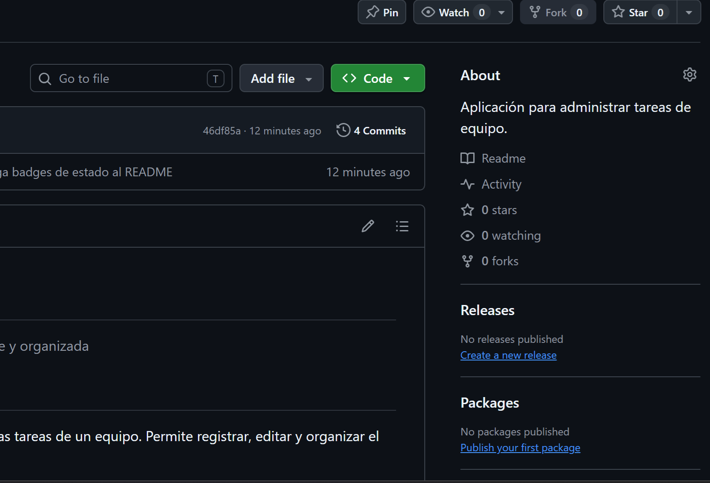
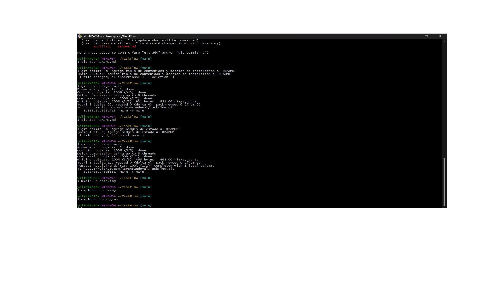

# TaskFlow

> Administra las tareas de tu equipo de forma simple y organizada

## Descripción

TaskFlow es una aplicación sencilla para administrar las tareas de un equipo. Permite registrar, editar y organizar el trabajo de cada integrante en un solo lugar.

## Funcionalidades

- Registrar tareas del equipo
- Editar tareas existentes
- Eliminar tareas
- Asignar tareas a usuarios

## Tecnologías utilizadas

- Git y GitHub para el control de versiones
- Markdown para la documentación
- Visual Studio Code como editor

## Requisitos

- Git instalado (versión 2.0 o superior)
- Una cuenta de GitHub
- Visual Studio Code o cualquier editor de texto
- Conexión a internet

## Checklist de funcionalidades

- [x] Registrar tareas
- [x] Editar tareas
- [ ] Eliminar tareas
- [ ] Asignar tareas a usuarios

## Tabla de contenidos

- [Descripción](#descripción)
- [Funcionalidades](#funcionalidades)
- [Tecnologías](#tecnologías-utilizadas)
- [Requisitos](#requisitos)
- [Instalación](#instalación)
- [Uso](#uso)
- [Contribuidores](#contribuidores)

## Instalación

1. Clonar el repositorio.
2. Configurar la base de datos.
3. Configurar las variables necesarias.
4. Ejecutar la aplicación.

## Uso

Una vez iniciada la aplicación, puedes registrar nuevas tareas, editarlas y asignarlas a los integrantes del equipo.

## Contribuidores

- [kerensandoval](https://github.com/kerensandoval)

# TaskFlow

> Administra las tareas de tu equipo de forma simple y organizada

## Tabla de contenidos
...

## Capturas de pantalla

### Pantalla principal

### Inicio de sesión

### Gestión de tareas

### Perfil de usuario

- [Capturas de pantalla](#capturas-de-pantalla)